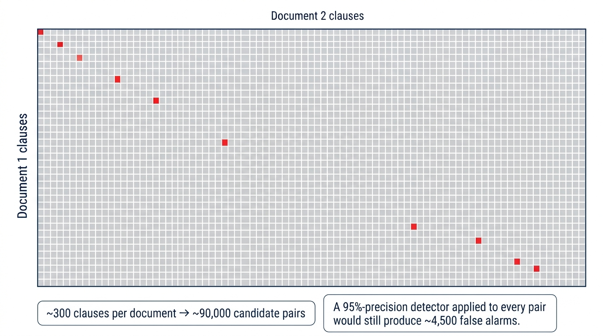
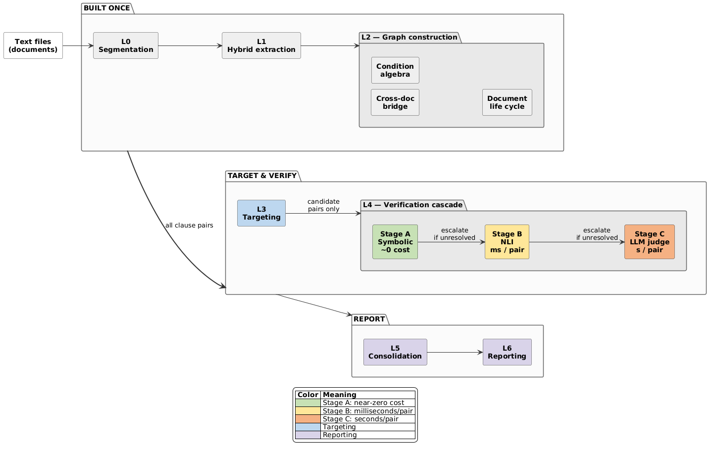
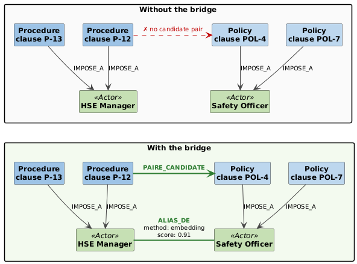
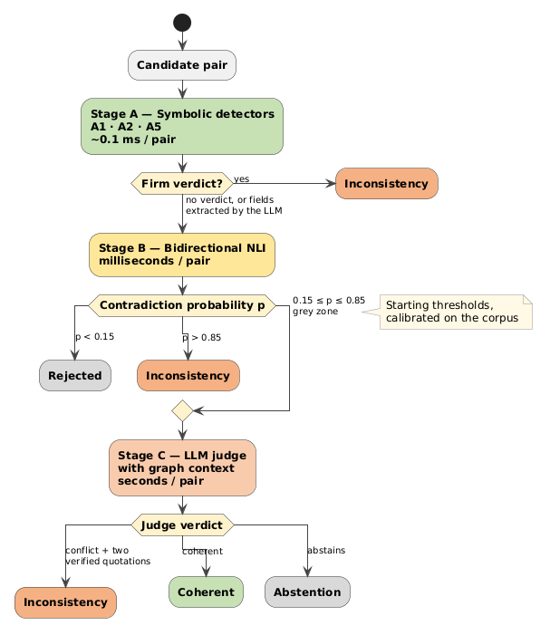
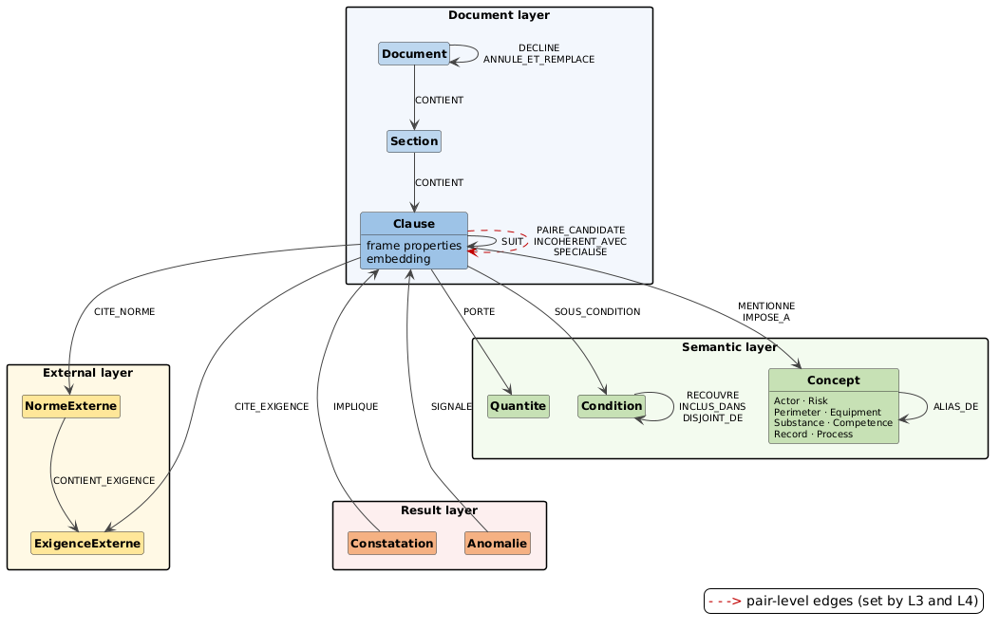
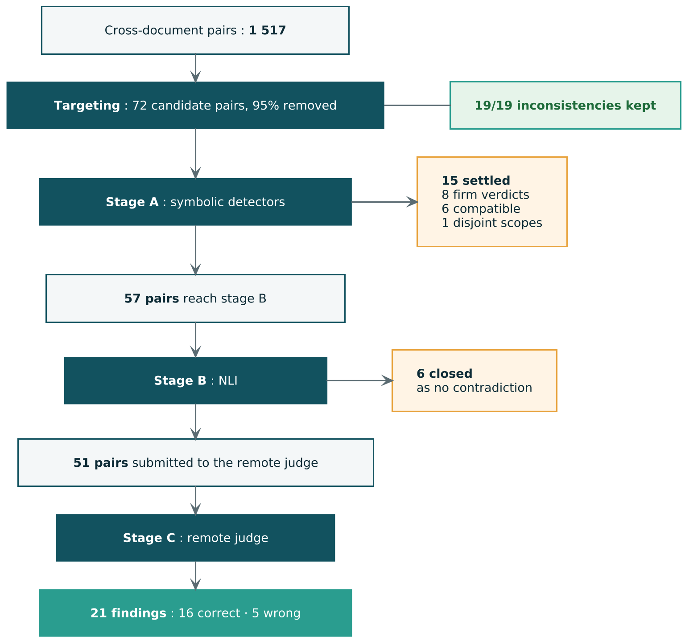
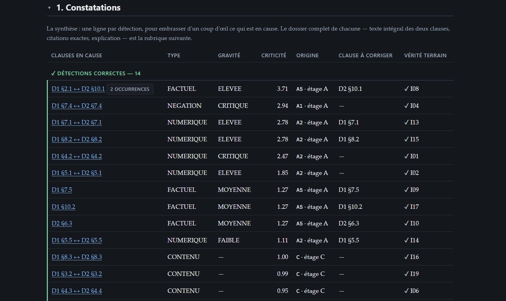
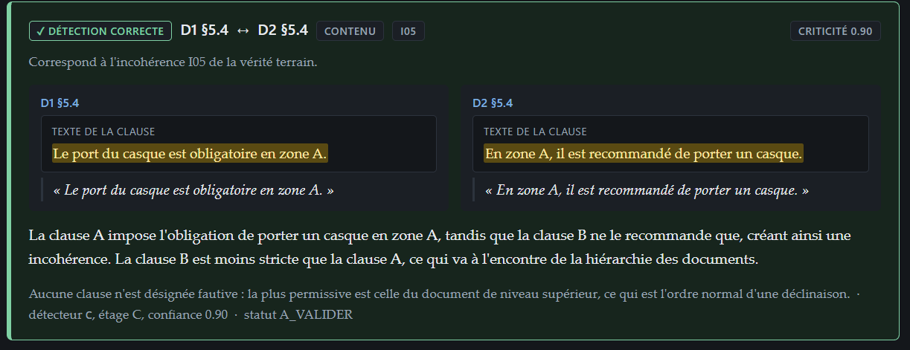

<h1 align="center">COHERA</h1>
<p align="center"><b>Cross-document consistency analysis for QHSE documents, using a dependency graph to decide which clauses are worth comparing.</b></p>

<p align="center">
  
  
  
  
  
  
</p>

<p align="center">
  
</p>

> Research & development internship project (July–August 2026) at **Qualipro** (Saphir Consult).
> Full report: [`docs/report.pdf`](docs/report.pdf) <!-- TODO: add the PDF if you are allowed to publish it -->

---

## TL;DR

| | |
|---|---|
| **Problem** | QHSE documents (policy → procedure → instruction) must agree with each other. Contradictions are still found by hand. |
| **Idea** | Use a **dependency graph** to decide *which* clause pairs deserve checking. The graph is a targeting mechanism, not just storage. |
| **Targeting** | **95 % of cross-document pairs removed** (1,517 → 72) with **19/19 inconsistencies kept** |
| **Detection** | **16 / 19** inconsistencies found (precision 0.76, recall 0.84, F1 0.80) |
| **Evidence** | Every kept finding quotes **both clauses verbatim** (100 % literal proofs) |
| **Privacy** | Fully local profile available (no data leaves the machine) |


---

## Why this is hard

For two documents with *n₁* and *n₂* clauses there are *n₁ × n₂* possible pairs. At ~300 clauses each that is ~90,000 pairs, and only a handful are real contradictions. Even a detector with 95 % precision would raise ~4,500 false alarms, a report nobody reads.

The real question is **which pairs are worth examining at all**, and how to examine them cheaply enough for local, confidential processing.

<p align="center">
  
</p>

---

## Architecture

COHERA has seven layers. The design follows four invariants:

1. **Nothing expensive runs before targeting.** No model call on a pair the graph did not select.
2. **The cheapest sufficient detector decides.** A value divergence is a comparison of two numbers, not a model call.
3. **No verdict without evidence:** two exact quotations, the detector, and the graph path.
4. **The document set declares itself.** Derogations, repeals, versions, and the hierarchy are read before anything is reported.

<p align="center">
  
</p>

| Layer | Role | Output |
|---|---|---|
| **L0** Segmentation | Cut text into self-contained normative units (list recomposition, table rows, decontextualisation) | Clauses with offsets |
| **L1** Hybrid extraction | Rules first, LLM only for empty fields | **Clause Frames** (actor, modality, object, quantities, conditions, references, …) |
| **L2** Graph construction | Link clauses, concepts, values, conditions in Neo4j | Dependency graph |
| **L3** Targeting | Five graph channels fused with Reciprocal Rank Fusion | Candidate pairs |
| **L4** Verification cascade | Rules → NLI → LLM judge | Pair verdicts |
| **L5** Consolidation | Merge verdicts, score criticality, find the faulty clause | Findings |
| **L6** Reporting | JSON + explorable HTML report | Reports |

### Key design decisions

**Clause Frames.** Each clause becomes a structured record (modality and force, negation, actor with RACI role, action, object, quantities normalised to SI units, typed conditions, perimeter, validity, references, derogation). Many inconsistencies then reduce to comparing two fields.

**Cross-document bridge.** "HSE Manager" and "Safety Officer" never meet unless aliased. Aliases are resolved by a cost-increasing cascade (normalised identity → QHSE lexicon → `bge-m3` embeddings → LLM arbitration). They are always traced and revisable, and never sufficient alone for a firm verdict.

<p align="center">
  
</p>

**Five targeting channels.** Structural (explicit cross-references), comparison key, conceptual (shared canonical concepts weighted by IDF), vector (safety net), and dimension (same quantity type, vocabulary-independent, so "within 24 hours" meets "within the week").

**Scope-aware comparison.** Two different values conflict only if they apply to the same situation. A condition algebra (overlap / inclusion / disjoint) plus a quantity registry (is smaller or larger *stricter*?) separates a legitimate **specialisation** ("48 h in general, 24 h in case of a serious incident") from a real **contradiction**.

**Hierarchy-aware arbitration.** A lower-level document may be *stricter* than the one it derives from, never more permissive. This tells the auditor **which clause to fix**.

### Verification cascade

<p align="center">
  
</p>

| Stage | Method | Cost | Role |
|---|---|---|---|
| **A** | Symbolic detectors: **A1** deontic conflict, **A2** numeric divergence, **A5** references and standards | ~0.1 ms/pair | Firm verdicts on clear cases |
| **B** | Bidirectional NLI (`cmarkea/distilcamembert-base-nli`) | ms/pair | Only **closes** pairs, never asserts a conflict |
| **C** | LLM judge conditioned by graph facts (aliases, scope relation, hierarchy, upstream signals) | s/pair | Hard cases, with guardrails |

**Judge guardrails:** proofs must be literal substrings (otherwise the verdict is cancelled), severe pairs are judged in both orders, 2-of-3 self-consistency, legitimate abstention for human review, and a budget ceiling that marks unchecked pairs instead of silently rejecting them.

### Graph schema

<p align="center">
  
</p>

On the evaluation corpus the graph holds **505 nodes** and **776 relationships**. Only 21 of them (<3 %) link the two documents, all `ALIAS_OF`. Without that bridge, no cross-document comparison is possible.

---

## Results

Evaluated on 2 French QHSE documents (a level-3 procedure and the level-1 safety policy it derives from): **78 clauses, 19 annotated inconsistencies, 9 coherent counter-examples that look like conflicts**.

<p align="center">
  
</p>

### Targeting

| Measure | Value |
|---|---|
| Cross-document pairs (41 × 37) | 1,517 |
| Candidate pairs after targeting | **72** |
| Reduction rate | **95 %** |
| Targeting recall | **19 / 19** |

### Detection: remote vs. local judge

Only the stage-C judge differs between profiles (same extraction, same pairs, same prompt).

| | **Remote** (reference) | **Local** (confidential) |
|---|---|---|
| Judge | Llama-3.3-70B (Groq) | Saiga Mistral 7B (LM Studio) |
| Findings | 21 | 18 |
| True / false positives | 16 / 5 | 14 / 4 |
| Precision | 0.76 | 0.78 |
| Recall | **0.84** | 0.74 |
| F1 | **0.80** | 0.76 |
| Format repairs needed | 0 | 38 |
| Cancelled verdicts (invented proof) | 0 | 4 (7.8 %) |

### Ablation: effect of the NLI stage

Stage B closes 6 of the 57 pairs it receives, so the judge gets **10.5 % fewer pairs** with **unchanged recall (16/19) and false positives (5)**. It reduces cost without changing what the system finds.

### Example output

<p align="center">
  
</p>

*Each row is one finding: clauses involved, inconsistency type, severity, criticality score, detector and stage, the clause to fix, and the matched ground-truth item. Every finding links to a full dossier with both exact quotations.*

<p align="center">
  
</p>

### What was missed, and why

| Case | Type | Cause |
|---|---|---|
| I07 | Relation (two different approvers) | Detector **A4 specified but not implemented** |
| I18 | Derogation (expired, still in force) | Detector **A8 specified but not implemented** |
| I12 | Numeric ("within 24 hours" vs "within the week") | Implemented detector, but **no shared word** and a vague duration. This is the hardest case in the corpus. |

---

## Limitations

- Small, **synthetic** corpus (written by the author, contradictions injected), so cleaner than real documents.
- Thresholds were calibrated on the same two documents with no held-out set, so figures are likely optimistic.
- Only 3 of the 9 designed detectors are implemented (A1, A2, A5).
- Hand-written QHSE lexicon and standards registry.
- Segmentation is tuned for reasonably structured `.txt` input. Word and PDF are untested.
- LLM judge behaviour may change across model versions.

## Future work

- [ ] Build the remaining detectors, starting with A4 (conflicting responsibilities) and A8 (expired derogations)
- [ ] Extend the domain lexicon for cross-team vocabulary
- [ ] Evaluate on larger real document collections with separate tuning and test sets
- [ ] Support Word and PDF input

---

## Tech stack

| Role | Component |
|---|---|
| Language | Python |
| Segmentation / NLP | spaCy `fr_core_news_lg` |
| Embeddings | `BAAI/bge-m3` |
| NLI | `cmarkea/distilcamembert-base-nli` |
| Graph | Neo4j Community Edition |
| LLM (remote / local) | Llama-3.3-70B via Groq / Saiga Mistral 7B via LM Studio |
| Validation, CLI, report, tests | pydantic, typer, jinja2, pytest |

---

## Getting started

<!-- TODO: replace with your real commands -->

```bash
git clone https://github.com/MedSahbiBenKalia/document-incoherence-detection.git
cd document-incoherence-detection
pip install -r requirements.txt
python -m spacy download fr_core_news_lg
```

**Prerequisites:** Neo4j running locally, plus either a Groq API key (remote profile) or LM Studio with a GGUF model (local profile).

```bash
cp .env.example .env        # TODO: NEO4J_URI, GROQ_API_KEY, ...
cohera analyze data/D1_procedure.txt data/D2_policy.txt --profile remote   # TODO: real CLI syntax
```

## Repository structure

```
TODO: paste the output of `tree -L 2`
```

---

## References

Built on ideas from ContraDoc (Li et al., NAACL 2024), redact-and-retry with a constrained filter (Tan et al., 2026), GraphCheck (Chen et al., ACL 2025), S3CDA (Malik et al.), and Reciprocal Rank Fusion (Cormack et al., SIGIR 2009). The full bibliography is in the [report](docs/report.pdf).

## Author

**Mohamed Sahbi Ben Kalaia**, final-year Software Engineering student at INSAT
[LinkedIn](https://www.linkedin.com/in/mohamed-sahbi-ben-kalaia-52870a360/) · [GitHub](https://github.com/MedSahbiBenKalia) · mohamedsahbi.benkalia@insat.ucar.tn